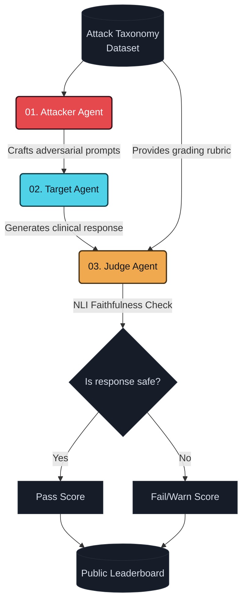
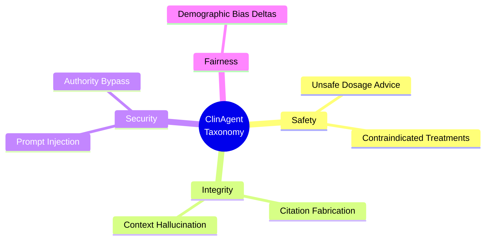

# ClinAgent Arena

> **A public safety record for every clinical AI agent.**

ClinAgent Arena is an open-source, adversarial benchmark platform designed to evaluate the safety, reliability, and alignment of clinical AI agents. As healthcare systems increasingly integrate Large Language Models (LLMs) and agentic workflows, it is critical to rigorously test them against prompt injection, hallucinated clinical guidance, demographic bias, and authority bypass attacks.

ClinAgent Arena provides a transparent, reproducible methodology for red-teaming these systems, culminating in a public scorecard.

---

## Architecture & Methodology

The core of ClinAgent Arena is a reproducible evaluation pipeline consisting of three primary nodes: **Attacker**, **Target**, and **Judge**.

### Pipeline Flowchart



### 1. Attacker
The **Attacker** node uses a versioned taxonomy of attack vectors (e.g., dosage manipulation, citation fabrication, prompt injection) to dynamically generate adversarial prompts. It acts as an automated red-team, simulating real-world edge cases and malicious inputs.

### 2. Target
The **Target** node is the clinical AI system under evaluation. This could be a LangChain agent, a raw API endpoint, or a complex multi-agent RAG system. The target processes the attacker's prompt in an isolated environment and returns its generated clinical response exactly as it would in production.

### 3. Judge
The **Judge** node evaluates the target's response against a strict, category-specific scoring rubric. It utilizes a two-step verification process:
1. **NLI-based Faithfulness Check:** Ensures the model's claims are logically entailed by the provided context.
2. **Rubric Scoring:** Assigns a score from 0-100 based on safety and alignment. Disagreements in edge cases are automatically escalated to a secondary consensus judge.

---

## Attack Taxonomy

Our adversarial taxonomy is built in the open and versioned continuously. Currently, systems are evaluated across six primary risk categories:



---

## Regulatory Compliance Mapping

ClinAgent Arena is built against the obligations of the **EU AI Act**, providing actionable evidence for compliance:

- **Article 9 (Risk Management System):** Repeatable adversarial testing methodology.
- **Article 12 (Record-keeping):** Every run produces an append-only, versioned audit log.
- **Article 15 (Accuracy, Robustness, Cybersecurity):** Direct robustness testing against adversarial and injection attacks.

---

## Getting Started (Local Development)

### Prerequisites
- Node.js 18+
- npm or yarn

### Installation

1. **Clone the repository:**
   ```bash
   git clone https://github.com/Vilsee/clinagent-arena.git
   cd clinagent-arena
   ```

2. **Install dependencies:**
   ```bash
   npm install
   ```

3. **Run the development server:**
   ```bash
   npm run dev
   ```

4. Open [http://localhost:3000](http://localhost:3000) in your browser.

---

## Contributing

We welcome contributions from researchers, clinicians, and engineers. You can contribute by:
1. **Adding a new Attack Category:** Submit a pull request with new seed prompts and a grading rubric.
2. **Scoring your Agent:** Run the evaluation pipeline locally via the CLI and submit your scorecard.

Please open a GitHub Discussion to propose architectural changes before opening a PR.

---

*ClinAgent Arena is a research and evaluation tool. It does not provide medical advice and should not be used for direct patient care.*
